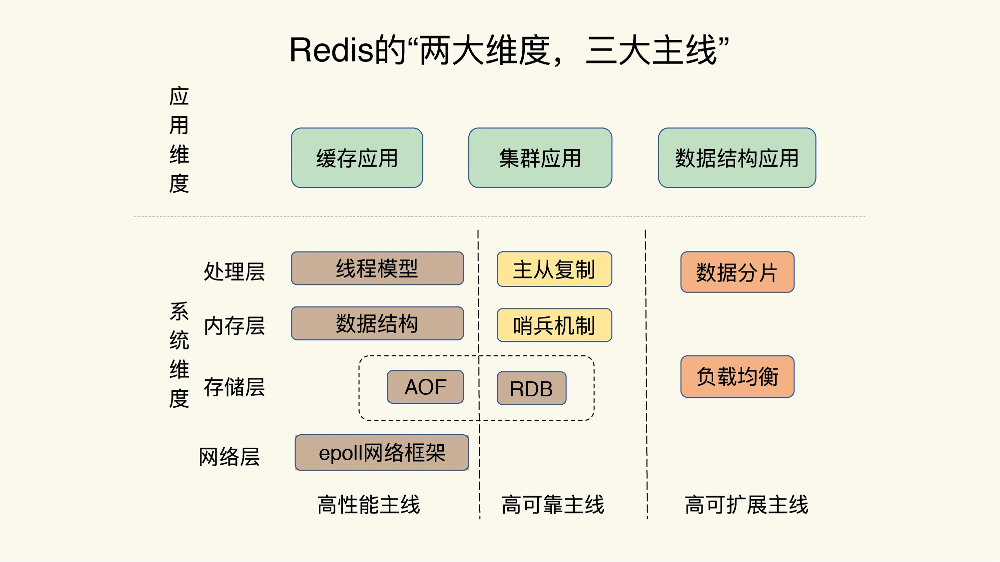

# Redis核心技术学习

## 开篇

**不要只关注零散的技术点，必须建立起一套完整的知识框架**

Redis使用碰到的坑主要在四个方面
* CPU使用上的坑，如数据结构复杂度，跨CPU核的访问
* 内存使用上的坑，如主从同步和AOF的内存竞争
* 存储持久化上的坑，如在SSD上做快照的性能都懂
* 网络通信上的坑，如多实例时的异常网络丢包

如何快速高效的形成系统观，即花更少的时间掌握更丰富的知识和经验，解决更多的问题？  
抓住主线，绘制出Redis的全景知识图（可做思维导图）。之后碰到知识点能快速归纳，碰到问题也可以快速定位。  

Redis知识全景图： 两大维度、三大主线  
两大维度： 系统维度、应用维度  
三大主线：高性能、高可靠、高可扩展  

* 高性能主线，包括线程模型、数据结构、持久化、网络框架
* 高可靠主线，包括主从复制、烧饼机制
* 高可扩展主线，包括数据分配、负载均衡

在应用维度上，可按两种方式学习： **应用场景驱动** 和 **典型案例驱动** ，这两者一个是面的梳理，一个是点的掌握

Redis问题画像

在碰到问题时，可对照该图找到对应的影响因素，快速定位问题

tips: 非易失内存NVM，既能保证高速读写，又能快速持久化数据  

## 基础篇

### 1.基本架构：一个键值数据库包含什么
学习Redis，不要一上来就直接研究一个个具体的技术点，容易迷失在细枝末节。更好的方式是**先建立起系统观**  
就是说想要深入理解和优化 Redis 必须先对它的总体架构和关键模块有一个全局的认知，再深入到具体的技术点。  
经过这样的过程再去定位和解决问题会跟轻松，这种方式也适合学习其他的任何技术。

**学习如何构造一个简单的键值数据库 SimpleKV**  
大体来说，一个键值数据库包括了**访问框架、索引模块、操作模块和存储模块**  

**模型和操作**  
首先考虑里面要存什么样的数据，和对数据可以做哪些操作，即**数据模型和操作接口**  
需注意：键值数据库无法像关系型数据库那样完成聚合计算，比如计算用户平均年龄等

SimpleKV需要支持的三种基本操作 
* PUT：写入或更新一个 key-value
* GET：根据一个 key 读取对应的 value
* DELETE：根据一个 key 删除整个 key-value
* SCAN：根据一段 key 的范围返回相应的 value
  
此外还有 EXISTS 操作接口，用于判断某个 key 是否存在

**数据保存**  
数据保存在内存，读写速度快，缺点是一旦断电数据会丢失
数据保存在外存，可以避免数据丢失，但受限于磁盘的慢速读写，性能拉低

**访问模式**  
访问模式通常有两种，一是**通过函数库调用的方式供外部应用使用**，比 libsimplekv.so，另一种是**通过网络框架以Socket通信的形式对外提供键值对操作**

通过网络框架提供键值存储服务扩大了键值数据库的受用面  
一个系统设计上的问题：网络连接的处理、网络请求的解析，数据存取处理，是用一个线程、多个线程，还是多个进程来交互处理呢？如何进行设计和取舍？我们把这个问题称为I/O模型设计  
使用单线程处理网络连接、解析请求、数据存取，一旦某一步操作阻塞，整个线程会被阻塞住，这会降低系统响应速度  
若使用多线程，即使某个线程被阻塞，其他线程依旧可以正常运行，但不同线程间如果需要访问共享资源会产生线程竞争，影响系统效率

**如何定位键值对的位置**  
在对SimpleKV进行操作时，SimpleKV需要查找对应的键值对是否存在，这依赖于索引模块  
**索引的作用是让键值数据库根据Key找到相应value的存储位置，进而执行操作**  
Memcached 和 Redis 采用哈希表作为 key-value 索引，而 RocketDB 采用调表作为索引  
Redis的value支持多种类型，当我们通过索引找到一个key所对应的value后，仍然要从 value 的复杂结构中进一步找到需要的数据  

**不同操作的具体逻辑是怎样的**  
* GET/SCAN，根据 value 的存储位置返回 value 的值
* PUT新的键值对数据时，需要为该键值对分配内存空间  
* Delete，删除键值对，释放相应的内存空间  

