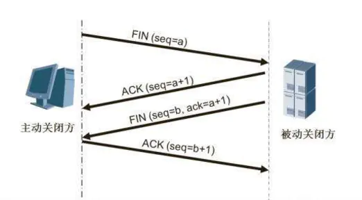
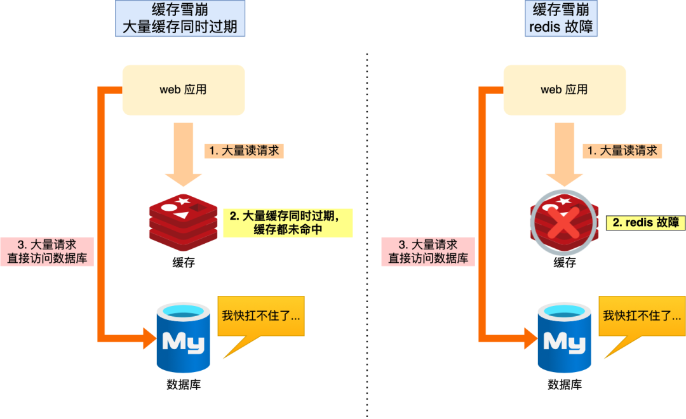

# 知识体系
本文档目的是为了梳理笔者编程数年学得的一些知识，将知识点记录，温故知新，方便学习  

## 数据结构与算法

### 逻辑结构
1. 集合
2. 线性结构
3. 树形结构
4. 图形结构

### 常用数据结构
1. 栈  
   栈是一种特殊的线性表，它只能在一个表的一个固定端进行数据结点的插入和删除操作。
2. 队列  
   队列也是一种特殊的线性表，它只允许在表的一端进行插入操作，另一端进行删除操作。
3. 数组  
   数组是一种聚合数据类型，它是将具有相同类型的若干变量有序地组织在一起的集合。
4. 链表  
   链表是一种数据元素按照链式存储结构进行存储的数据结构，这种存储结构具有在物理上存在非连续的特点  
5. 树  
   树是典型的非线性结构，它是包括，2 个结点的有穷集合
6. 图  
   图是另一种非线性数据结构。在图结构中，数据结点一般称为顶点，而边是顶点的有序偶对
7. 堆  
   堆是一种特殊的树形数据结构，一般讨论的堆都是二叉堆
8. 跳表  
9. 哈希表  
   源自哈希函数，通过把关键码值映射到表中一个位置来访问记录，以加快查找的速度。

### 常见算法及场景
**算法**
> 递归
> 排序
> 二分查找
> 搜索
> 哈希算法
> 贪心算法
> 分治算法
> 回溯算法
> 动态规划
> 字符串匹配算法


增删改查  
排序  

## 操作系统
操作系统(Operating System)是管理计算机硬件软件资源的程序。  
操作系统会控制其他程序运行，管理系统资源，提供最基本的计算功能，如管理及配置内存、决定系统资源供需的优先次序等，同时还提供一些基本的服务程序，例如：
1. 文件系统  
   提供计算机存储信息的结构，信息存储在文件中
2. 设备驱动程序  
   提供连接计算机的每个硬件设备的接口，设备驱动器使程序能够写入设备，而不需要了解执行每个硬件的细节
3. 用户接口  
   为用户提供一种运行程序和访问文件系统的方法
4. 系统服务程序 
   当计算机启动时，会自启动许多系统服务程序，执行安装文件系统、启动网络服务、运行预定任务等操作

在Linux操作系统中，**一切皆文件**

### 常用指令
具体命令说明可在 Linux 下使用 man 查询  

**用户相关指令**  
``` SHELL
# 创建用户
$ useradd user1
# 设置密码
$ passwd user1
# 显示当前登录身份
$ who
# 显示当前登录系统的所有用户的用户列表
$ users
```   
参考链接 [**Linux用户管理**](https://www.cnblogs.com/renshengdezheli/p/13947125.html)

**目录与文件相关指令**
``` SHELL
# 打印当前目录
$ pwd
# 切换目录 .代表当前目录 ..代表上级目录
$ cd /dir1/dir2
# 创建目录
$ mkdir dir1
# 查看当前目录大小
$ du -sh ./
# 查看磁盘容量
$ df -h

# 设置或更新文件访问时间，若文件不存在则创建文件
$ touch file1
# 删除文件
$ rm file1
# 移动文件 将 file1 file2 file3 移动到目录 dir1 中
$ mv file1 file2 file3 dir1
# 重命名文件 将文件 file1 重命名为 file2
$ mv file1 file2
# 复制文件 -p复制时间权限 -a可复制目录
$ cp file1 file2
$ cp -a dir1 dir2

# 从本地复制文件到远程目录 remote_dir1 下
$ scp local_file1 remote_user@remote_ip:remote_dir1
# 从本地复制文件到远程，名称为 remote_file1
$ scp local_file1 remote_user@remote_ip:remote_file1
# 从远程复制到本地 -r 递归复制 -P 指定端口
$ scp -P 4588 -r remote_user@remote_ip:remote_dir1 local_dir1

# 修改文件拥有者
$ chown user1:group1 file1
# 修改目录即目录下所有文件拥有者
$ chown -R user2:group2 dir2
# 修改文件权限
$ chmod 777 file1
$ chmod -R 777 dir1

# 打印文件内容
$ cat file1
# 查看文件内容，可在文件中搜索
$ less file1
# 显示文件最后20行
$ tail -20 file1
# 跟踪显示文件最后30行
$ tail -30f file1

# 合并显示两个文件内容
$ paste file1 file2

# 排序后显示两个文件内容
$ sort file1 file2
# 排序后显示两个文件内容，取并集，重复只保留一行
$ sort file1 file2 | uniq
# 排序后显示两个文件内容，删除交集，留下其他行
$ sort file1 file2 | uniq -u
# 排序后显示两个文件内容，取交集
$ sort file1 file2 | uniq -u

# 将 file1 和 file2 内容合并输出到 file3
$ cat file1 file2 > file3

# 压缩
$ tar -czvf abc.tar.gz /home/user1/abc
# 解压到 dir1 目录下
$ tar -xzvf abc.tar.gz -C dir1


# 下载 url 文件资源
$ curl -# -O http:///www.linux.com/lwl.jpg
# 发出 POST 请求
$ curl -X POST https://www.example.com
$ curl localhost:3000/api/json -X POST -d '{"name": "John"}' --header "Content-Type: application/json"

# 下载 url 文件资源 -b 后台下载
$ wget -c -b -O wordpress.zip https://cn.wordpress.org/wordpress-4.9.4-zh_CN.tar.gz
# ftp 下载 csc.txt 文件
$ wget --ftp-user=baidu --ftp-password=123 ftp://192.168.19.1/lwl/csc.txt

```   

**搜索相关指令**  
``` SHELL
# 查询文件名，在 dir1 目录下后缀名为 .txt 的文件
$ find dir1 -name '*.txt'
# 列出当前目录及其子目录所有文件
$ find . -type f
# 搜索在10天内被创建或者修改过的文件
$ find /usr/bin -type f -mtime -10 

# 查询 dir1 目录下包含内容为 abc 的文件，并打印出行
$ grep -rn 'abc' dir1
# 查询文件 file1 下不包含 abc 的行
$ grep -v 'abc' file1

```
**进程相关指令**  
``` SHELL
# 查找 nginx 进程
$ ps -ef | grep nginx
# 杀死进程
$ kill process_id1
# 强制杀死进程
$ kill -9 process_id1
# 显示系统中各个进程的资源占用情况
$ top
# 两种方法查看 8888 端口占用情况
$ lsof -i:8888
$ netstat -pan|grep :8888
```


### 特殊符号
1. 重定向输出符号(覆盖) >
2. 重定向输出符号(追加) >>
3. 管道符号 |
4. 匹配任意字符 *
5. 匹配任意一个字符 ?
6. 后台进程符 &
7. 逻辑与 && 
8. 单引号 '
9. 双引号 "
10. 反引号 `


### 常见问题
内存泄漏，系统分配给程序的内存因为某种原因未释放或无法释放，导致程序运行缓慢甚至系统崩溃

### 推荐书籍
1. 《深入理解计算机系统》  
2. 《Unix环境高级编程》  
3. 《鸟哥的Linux私房菜》  

## 编程语言
### C
### Rust
### JavaScript
JavaScript是一门**基于对象(Object-Based)**的语言，却不是一门**面向对象的语言(ObjectOriented Programming Language)**，因为面向对象语言天生支持**封装、继承、多态**，但JavaScript并没有直接提供多态的支持  
JavaScript中实现继承的方式非常简单，只是在对象中添加了一个成为原型的属性，把继承的对象通过原型链接起来，就是心啊了继承，这种继承方式就称为基于原型链的继承。  
JavaScript中的对象也很简单，每个对象就是由一组组属性和值构成的集合  
对象的属性由三种类型：  
1. **原始类型**  
  原始类型数据是指值本身无法被改变的类型，有如下七种
    - Number
    - String
    - Bigint
    - Boolean
    - Null
    - Undefined
    - Symbol

2. **对象类型**  
  对象的属性值可以是另外一个对象
3. **函数类型**  
  对象的属性值若是函数，那么我们把这个属性称为方法。

#### 作用域

**变量提升**  


#### 语句和表达式
#### 函数

**立即执行函数表达式**  

#### 原型链
#### 闭包
#### this

### Node.js

#### 概述
Node.js是一个让JavaScript运行在服务端的平台  
Node.js是瑞安·达尔（Ryan Dahl）在2009年写出来的。结合了Google的V8、事件驱动模式和低级I/O接口。  
与顺序编程方式会造成阻塞或消耗更多资源不同，Node.js提供了基于事件驱动和非阻塞的接口，更适用于编写高并发状态下的程序。  

**Node.js运行时环境**  


* V8  
V8是为Google Chrome设计的JavaScript运行引擎。V8用C++写成，它把JavaScript源代码编译成本地机器码后执行
* libuv  
libuv是一个提供异步功能的C库，在运行时负责一个事件循环、一个线程池、文件系统I/O，DNS相关和网络IO以及一些其他重要功能
* 其他底层依赖  
如 c-ares、crypto (OpenSSL)、http-parser 以及 zlib。这些依赖提供了对系统底层功能的访问，包括网络、压缩、加密等  
* 应用模块
即自己书写的Node.js代码，npm install的模块代码
* Binding
一些胶水代码，把C/C++写的一些核心的库接口暴露给JS环境
* Addons
一些胶水代码，调用其他第三方或者自己的C/C++库，需要自己手动完成。本质上都是完成桥接的作用，使得应用与底层库能够互通有无。

**回调函数**  
把函数A作为参数传递给另一个函数B，B会在达成某种条件之后执行A函数，此时称A为回调函数
``` JavaScript
function handle (err, data) {
  // do something...
}
// 此处handle就是回调函数
fs.readFile('./test.json', handle)
```

**同步异步**  
同步：在发起一个请求后要等待结果返回才会进行下一步  
异步：在发起一个请求后不等结果返回，往下执行其他任务，等结果返回后再执行相应操作  
> 从编程角度理解，同步IO就是进程/线程发起IO调用后，需要等待操作系统 完成IO工作并告知进程已完成，进程/线程才能继续往下执行其他指令。  
> 异步IO就是进程/线程发起IO调用后，不必等待操作系统IO执行完毕，可直接继续往下执行其他指令。操作系统完成IO后，当前进程/线程会得到通知


**阻塞非阻塞**  
阻塞和非阻塞关注的是**程序在等待调用结果（消息，返回值）时的状态**  
阻塞调用是指调用结果返回之前，当前线程会被挂起。调用线程只有在得到结果之后才会返回。  
非阻塞调用指在不能立刻得到结果之前，该调用不会阻塞当前线程。  

**单线程**  
Node.js的单线程指的是JavaScript代码的执行是单线程的（开发者编写的代码运行在单线程环境中），把需要做的I/O交给libuv，I/O完成后会执行开发者定义的回调函数  


优势：
  * 适合高并发的应用场景
  * 线程安全，编写程序不必考虑线程切换
  * 比多线程占用资源少，没有创建、切换、销毁线程的开销

劣势：
  * 不适合CPU密集型计算应用
  * 无法利用多核CPU
  * 单线程抛出异常使整个程序停止

**线程和进程**  


#### V8

#### 事件循环
Node.js的事件循环由**libuv**模块支持，与浏览器的JavaScript事件循环并不相同  


[参考官网的事件循环说明](https://nodejs.org/zh-cn/docs/guides/event-loop-timers-and-nexttick/)  


* 定时器：本阶段执行已经被 setTimeout() 和 setInterval() 的调度回调函数。
* 待定回调：执行延迟到下一个循环迭代的 I/O 回调。
* idle, prepare：仅系统内部使用。
* 轮询：检索新的 I/O 事件;执行与 I/O 相关的回调（几乎所有情况下，除了关闭的回调函数，那些由计时器和 setImmediate() 调度的之外），其余情况 node 将在适当的时候在此阻塞。
* 检测：setImmediate() 回调函数在这里执行。
* 关闭的回调函数：一些关闭的回调函数，如：socket.on('close', ...)。


不同版本Node打印结果不一致
``` JavaScript

setTimeout(() => {
  console.log('time1')
  Promise.resolve().then(()=> {
    console.log('promise1')
  })
}, 0);
setTimeout(() => {
  console.log('time2')
  Promise.resolve().then(()=> {
    console.log('promise2')
  })
}, 0);
```
浏览器环境下，microtask的任务队列是每个macrotask执行完之后执行。  
而在Node.js中，microtask会在事件循环的各个阶段之间执行，也就是一个阶段执行完毕，就会去执行microtask队列的任务。  


Node11和之后的版本，一旦一个阶段执行完就会立即执行微任务队列，因此会打印 `time1 => promise1 => time2 => promise2`  
Node10和之前的版本结果随机，关键在于第一个定时器执行完第二个是否在已完成队列中  
* 如果第二个定时器不在已完成队列，则打印`time1 => promise1 => time2 => promise2`  
* 如果第二个定时器在已完成队列，则打印 `time1 => time2 => promise1 => promise2`  


**setTimeout 和 setImmediate**  
setImmediate() 和 setTimeout() 很类似，但是基于被调用的时机，他们也有不同表现。  

setImmediate() 设计为一旦在当前 轮询 阶段完成， 就执行脚本。  
setTimeout() 在最小阈值（ms 单位）过后运行脚本。  
执行计时器的顺序将根据调用它们的上下文而异。如果二者都从主模块内调用，则时序将受进程性能的约束（这可能会受到计算机上其他正在运行应用程序的影响）。
``` JavaScript
setTimeout(() => {
  console.log('timeout');
}, 0);

setImmediate(() => {
  console.log('immediate');
});
// 打印顺序不定
```
但如果把两个函数放入一个 I/O 循环内调用，setImmediate 总是被优先调用：  
``` JavaScript
const fs = require('fs')
fs.readFile(__filename, () => {
   setTimeout(() => {
      console.log('timeout');
   }, 0);
   setImmediate(() => {
      console.log('immediate');
   });
})
// 此时固定打印顺序 immediate timeout
```


使用 setImmediate() 相对于setTimeout() 的主要优势是，如果setImmediate()是在 I/O 周期内被调度的，那它将会在其中任何的定时器之前执行，跟这里存在多少个定时器无关。

**process.nextTick**  
process.nextTick() 从技术上讲不是事件循环的一部分。相反，它都将在当前操作完成后处理 nextTickQueue， 而不管事件循环的当前阶段如何。
``` JavaScript
let a
function foo (callback) {
  callback() // 此处打印 undefined
  process.nextTick(callback) // 此处打印 3
}
function callback() {
  console.log(a)
}
foo(callback)
a = 3
```

process.nextTick() 在同一个阶段立即执行。  
setImmediate() 在事件循环的接下来的迭代或 'tick' 上触发。  
process.nextTick() 比 setImmediate() 触发的更快


#### 语法
#### 模块
#### 流

**Node.js 出现内存泄漏的场景**  
[内存泄漏示例](https://blog.csdn.net/qq_37051858/article/details/113421196)

CPU占用飙升原因分析
CPU用于计算，占用过高一般是因为某个循环运算，甚至是循环异步请求来处理数据。也有另一个可能，V8的GC过程也会独占线程资源，此时也会占用大量CPU运算资源

### TypeScript


## 网络相关

### 网络概念
以太网  
互联网
因特网  
万维网  
局域网  
广域网

地址  
域名  
路由  
协议  

统一资源定位符 URL  
超文本传输协议 HTTP
超文本标记语言 HTML
浏览器

**性能指标**  
1. 速率  
   连接在网络上的设备在信道上传送数据的速率，也称为数据率或比特率。
2. 带宽  
   它描述的是网络的通信线路传送数据的能力。即：在单位时间内从网络中的某一个点到另一点所能通过的“最高数据率”。
3. 延迟  
   衡量的是特定信息块通过系统所需要的时间，高延迟不一定意味着低带宽。
4. 抖动  
   即延迟的可变性。
5. TPS  
   Transactions Per Second. 服务器每秒处理的事务数。包括了消息入和出，加上一次数据库访问
6. QPS
   Queries Per Second. 每秒的查询数，即一台服务器每秒能够相应的查询次数
7. 吞吐量
   吞吐量是指系统在单位时间内处理请求的数量，TPS、QPS都是吞吐量的常用量化指标。  
8. 并发数  
   指单位时间内系统同时能正常处理的请求数量  
9. 并发用户数  
   系统可以同时承载的正常使用系统功能的用户数
10. PV  
   Page View. 页面访问量，用户每刷新一次即计算一次
10. UV  
    Unique Visitor. 独立访客，统计一天内访问某站点的用户数
11. RT  
   Reaction Time. 响应时间是指系统对请求作出响应的时间

**TPS 和 QPS 区别**  
（1）如果是对一个查询接口压测，且这个接口内部不会再去请求其它接口，那么 TPS = QPS，否则，TPS ≠ QPS
（2）如果是容量场景，假设 N 个接口都是查询接口，且这个接口内部不会再去请求其它接口，QPS = N * TPS 

### 网络模型
**OSI七层模型**  
开放式系统互联通信参考模型（Open System Interconnection Reference Model），简称为OSI模型
由国际标准化组织提出

1. 物理层
2. 数据链路层
3. 网络层
4. 传输层
5. 会话层
6. 表示层
7. 应用层
   
**TCP/IP五层模型**  
互联网协议(Internet Protocol Suite) 是一个网络通信模型，以及一整个网络传输协议家族，为互联网的基础通信架构
通常被称为 TCP/IP 协议簇
被视为简化的七层 OSI 模型
最早发源于美国国防部的ARPA网项目

1. 物理层
2. 数据链路层
3. 网络层
4. 传输层
5. 应用层

### 网络协议
#### IP
#### TCP
**三次握手**  
  

**四次挥手**   


#### UDP
#### HTTP
**概述**  
HTTP是一个应用层的面向对象的协议  

特性  
无连接：限制每次连接只处理一个请求  
无状态：对事务无记忆，请求之间的数据相互独立

**URL**  
URL是一种特殊类型的URI，格式如下  
> http://host[":"port][path]  

http 通过HTTP协议定位网络资源  
host 合法的主机域名或IP地址  
port 制定一个端口号，缺省值为80  
path 请求资源的URI，若无path，则必须以"/"的形式给出(通常由浏览器完成)  
例如  
> http://www.baidu.com/  
> http://115.239.210.27/index.php  


**结构**  
请求行  

请求头  

请求体  

**缓存**  
**加密**  
**HTTP1.1**  

#### SSL
#### HTTPS


### CDN
Content Delivery Network，即内容分发网络  
实时根据网络流量和各节点连接、负载、用户距离和响应时间来将用户请求导向最近的服务节点上

**目的**  
解决因分布、带宽、服务器性能带来的访问延迟问题
适用于站点加速、点播、直播场景

**限制**  
对不经常访问的资源无效  
对不断变化的资源不适用  

**机制**  
客户端向CDN节点请求数据时，CDN会判断缓存数据是否过期  
若缓存数据没过期则将缓存返回给客户端  
否则CDN节点向源站发出回源请求获取最新数据，更新缓存并返回给客户端
因此内容修改后可加上版本号来让CDN重新获取资源  

### 网络安全
#### DNS劫持
#### 跨站脚本攻击XSS
#### 跨站请求伪造CSRF
攻击机制：
用户登录网站A时访问了网站B(攻击方)
网站B利用用户在网站A的cookie来向网站A发起请求

防御方式：
1. 通过验证 token 的值、HTTP头的 referer 或验证码来检测用户提交
2. 尽量不在 URL 中暴露用户隐私信息
3. 用户修改删除等操作都使用 post 提交
4. 站通用的 cookie，严格设置 cookie 的域
   
#### 分布式拒绝服务攻击DDos


## 服务器架构
### 接口设计
#### RESTful
#### GraphQL
#### BFF
#### 幂等性
1. 查询 天然幂等
2. 删除 也是幂等的，但返回结果可能不一样，数据不存在返回0，数据多条返回多个
3. 新增 给表添加唯一索引  
   
**Token机制**：在数据提交前需向服务申请token，token在生成时同时存入redis，数据提交后删除redis中的token，若删除成功则继续，否则说明不是第一次请求了  
**状态机幂等**：在更新数据时添加状态条件，例如修改上架货物为下架时，更新条件加上上架状态  
**对第三方接口保持幂等**：如接入商户提交付款请求时需添加source+seq，即来源+序列号，并在数据表里添加为组合唯一索引  


### 身份认证
#### Cookie
#### Session
注册登录 ->  
服务端将 user 存入 session ->  
服务端将 sessionId 发送到浏览器 ->  
浏览器将 sessionId 存入 cookie ->  
浏览器每次请求都带上 cookie ->  
服务端根据 cookie 里的 sessionId 确认 session 中对应的 user  
#### Token
#### JWT
Json Web Token
由 头部.载荷.签名 组成
header.payload.signature

**场景**  
用户认证、接口认证

如实现用户长期登录：  
生成 jwt 后作为 access_token 返回给登录用户，并将 uid:jwt 组合作为 key 存入 redis，设置过期时间为七天  
当用户携带 access_token 访问接口时，判断是否有效且在 redis 中存在，若存在则延长过期时间 否则提示权限失效，重新登陆  
用户登出和修改密码时删除 redis 中的旧 access_token，并按规则生成新的存入、返回  


### 单点登录
可参考 JWT 或 OAuth2.0 方案

### 微服务
微服务是一种架构风格  
微服务颗粒比较小，一个大型复杂软件应用由多个微服务组成  
采用 UNIX 设计哲学，每种服务只做一件事，是一种松耦合的能够被独立开发和部署的无状态化服务（独立扩展、升级和可替换）  
各个微服务可以用不同的语言实现  
如微服务A使用 Node.js   
微服务B使用 PHP  

**优缺点**  
优点：开发效率高，灵活，高可用
缺点：性能延迟，分布式事务，集成测试，故障诊断

**实现方式**  
把系统划分成非常小的模块，且这些模块都可以通过一种标准的接口(REST API)进行沟通  
所有的请求都发送到 API 网关，再由网关统一向各个微服务转发请求。

### 消息队列
异步处理  
削峰填谷  
解耦合  
### RabbitMQ

### 秒杀场景
高并发场景应对
### 分布式架构
### Nginx
### Docker
### Kafka
### Zookeeper
ZooKeeper 是 Apache 软件基金会的一个软件项目，它为大型分布式计算提供开源的分布式配置服务、同步服务和命名注册。

### ElasticSearch

## 数据库
### MySQL
一个开源的关系型数据库管理系统

#### 范式
**第一范式**  
每个列都不可再分  

**第二范式**  
在遵循第一范式的基础上，非主键列都依赖于主键列，而不能是依赖主键列的一部分  

**第三范式**  
在第二范式的基础上，非主键列只依赖于主键，不依赖于非主键

### PostgraSQL
### Redis

redis-cli -h host -p port -a password
#### 缓存穿透、缓存雪崩、缓存击穿

一般加缓存的目的是：为了减轻数据库的压力，提升系统的性能。  


**缓存雪崩**  
为了保证缓存和数据库的数据一致性，通常会设置 redis 过期时间  
用户访问的数据若不在缓存则需访问数据库生成新的缓存  


当大量数据在同一时间失效(过期)或 redis 宕机时，请求全部转移到数据库，导致数据库压力骤增，甚至宕机导致系统崩溃等一系列问题，这就是缓存雪崩。  


针对两个诱因有不同的对策  
1. 大量数据同时过期  
   ① 均匀设置过期时间  
      设置过期时间时，可以加上一个1-60s的随机数，避免同一时间内大量数据同时过期  
   ② 互斥锁  
      当业务线处理请求时，如果发现访问的数据不在缓存，则加个互斥锁，保证同一时间只有一个请求来构建缓存，构建完成后再释放锁。  
      未能获取锁的请求返回空值或默认值或者等待锁释放。  
      互斥锁要设置一个过期时间，否则若请求出问题阻塞了会导致锁无法释放，其他请求拿不到锁系统无法响应。  
   ③ 双key策略  
     存两份缓存数据，一个主key加过期时间，一个副无过期时间，在查询时先获取主key数据，若无则返回副key数据。在更新缓存时同时更新两份缓存数据  
   ④ 后台更新缓存  
     业务线程不负责更新缓存，缓存也不设置有效期，将缓存更新工作交给后台线程定时更新  
     不设置有效期并不意味着数据一直有效，当系统内存紧张时，有些缓存数据会失效，在下一次后台定时更新缓存的这段时间内，业务读取失败会返回空值  
     解决方式有两种，一是后台线程不仅负责定时更新缓存，也负责频繁的检测缓存是否有效，若失效则从数据库读取数据并更新到缓存，检测时间间隔不能太长。二是在业务线程发现缓存数据失效后，通过消息队列发送通知给后台线程更新缓存，后台线程验证缓存确实失效后读取数据库加载到缓存，这种方式比第一种更新更及时，用户体验更好。  
     在业务刚上线时，提前把数据缓存起来，而不是等到用户访问才触发构建缓存，这叫缓存预热，后台更新缓存的机制也适合做这件事  

2. Redis宕机
   ① 服务熔断或请求限流机制  
     当 Redis 故障宕机导致缓存雪崩问题时，可以启动**服务熔断**机制，**暂停业务系统对缓存服务的访问，直接返回错误**，不在继续访问数据库，降低数据库访问压力，保证数据库服务正常运行，等Redis服务恢复正常后，再允许业务系统访问缓存  
     服务熔断机制虽然保护了数据库正常运行，但是关闭了缓存系统，会导致业务系统不可用  
     可以启用**请求限流**机制，**只将少部分请求发送到数据库处理，再多的请求在入口就拒绝服务**，等Redis服务恢复正常后再解除限流机制
   ② 构建Redis缓存高可靠集群
     通过主从节点方式构建Redis缓存高可靠集群  

**缓存击穿**  
在业务中通常有些数据会被频繁访问，如秒杀活动，这些被频繁访问的数据叫热点数据  
如果缓存中某个热点数据过期了，大量请求访问该热点数据，在缓存中找不到数据，导致数据库被高并发的请求冲垮，这就是缓存击穿。  


缓存击穿和缓存雪崩很类似，可以认为缓存击穿是缓存雪崩的一个子集  

应对缓存击穿的方案  
1. 互斥锁方案，保证同一时间只有一个业务线程更新缓存，未能获取互斥锁的请求，要么等待锁释放后读取缓存，要么返回空值或默认值  
2. 不给热点数据设置过期时间，由后台异步更新缓存，或者在热点数据要过期前，提前通知后台线程更新缓存以及重新设置过期时间  


**缓存穿透**  
当发生缓存雪崩或者击穿时，数据库中还是有要访问的数据的，一旦缓存恢复相应数据，就可以缓解数据库压力，但是缓存穿透不同。  
当用户访问的数据既不在缓存中，也不在数据库中，无法构建缓存数据来服务后续请求。  
当有大量的这种请求到来，数据库压力骤增，这就是**缓存穿透**  


缓存穿透有两类情况产生：  
1. 业务误操作，缓存中数据和数据库中的数据都被误删，导致两者都没有对应数据  
2. 黑客恶意攻击，故意大量访问某些读取不存在数据的业务  

应对方案有三种：
1. 非法请求的限制  
   在API入口处判断请求参数是否合理，若判断是恶意请求则直接返回错误  
2. 缓存空值或者默认值  
   针对查询数据设置空值和默认值，后续请求即可从缓存读取空值和默认值给应用，不会继续查询数据库  
3. 使用**布隆过滤器**快速判断数据是否存在  
   可以在写入数据库时，使用布隆过滤器做标记，在用户请求到来，缓存失效后，查询布隆过滤器快速判断数据是否存在，不存在则不查询数据库  
   即使发生了缓存穿透，大量请求只会查询 Redis 和布隆过滤器，而不会查询数据库，保证了数据库的正常运行  


**布隆过滤器**  
布隆过滤器由**初始值都为0的位图数组**和**N个哈希函数**两部分组成  
当我们写入数据库时，在布隆过滤器做个标记，下次查询数据时先查询布隆过滤器，若无标记则表示不在数据库中  

布隆过滤器通过三个操作完成标记  
* 第一步，使用N个哈希函数分别对数据做哈希计算，得到N个哈希值  
* 第二步，将第一部得到的N个哈希值对位图数组的长度取模，得到每个哈希值在位图数组的位置  
* 第三步，将每个哈希值在位图数组的对应位置的值置为1


布隆过滤器偈语哈希函数实现查找，高效查找的同时存在哈希冲突的可能，如数据x, y都在1,4,6位置，而事实上数据库中不存在数据y，存在误判的可能  

因此，**查询布隆过滤器说数据存在，并不一定证明数据库存在这个数据，但是查询到数据不存在，那么数据库中一定不存在这个数据**  

**总结**  
缓存异常的三个问题中，缓存雪崩和缓存击穿主要原因是数据不在缓存中，导致大量请求访问数据库，数据库压力骤增导致系统崩溃。  
不过一旦数据被重新加载回缓存，应用又可以从缓存快速读取数据，不再访问数据库，数据库的压力也会降下来，因此两者的应对方案类似  

而缓存穿透主要原因时数据既不在缓存也不在数据库中。因此应对措施与前两者不同。  


### MongoDB

## 密码学
### 名称概念
明文  
密钥  
密文  
  
加密  
解密  

### 对称加密
对称加密的意思就是加密和解密用同一个Key  

AES (Advanced Encryption Standard) 密钥长度可以是 128、192 或 256。  
它是 DES 算法的替代者，安全强度很高，性能也很好，而且有的硬件还会做特殊优化，所以非常流行，是应用最广泛的对称加密算法。  

### 非对称加密
非对称加密有两个密钥，一个公钥(public key)，一个私钥(private key)，公钥可公开，私钥需保密  

公钥加密后只能用私钥才能解密  
私钥加密后只有公钥才能解密  

RSA 是其中最著名的非对称加密算法，几乎可以说是非对称加密的代名词  
ECC（Elliptic Curve Cryptography）是非对称加密里的后起之秀，在安全强度和性能上都有明显的优势  

### 混合加密
非对称加密都是基于复杂的数学难题，所以运行起来非常慢，而对称加密在保存密钥上又不安全，所以TLS使用混合加密的方式来解决出现的这些问题。

现在 TLS 里使用的混合加密方式，其实说穿了也很简单：  

1. 在通信刚开始的时候使用非对称算法，比如 RSA、ECDHE，首先解决密钥交换的问题。  
2. 然后用随机数产生对称算法使用的“会话密钥”（session key），再用公钥加密。因为会话密钥很短，通常只有 16 字节或 32 字节，所以慢一点也无所谓。
对方拿到密文后用私钥解密，取出会话密钥。
3. 这样，双方就实现了对称密钥的安全交换，后续就不再使用非对称加密，全都使用对称加密。


总之，SSL 就是通信双方通过非对称加密协商出一个用于对称加密的密钥

[参考文章链接](https://www.cnblogs.com/r1-12king/p/15880436.html)


